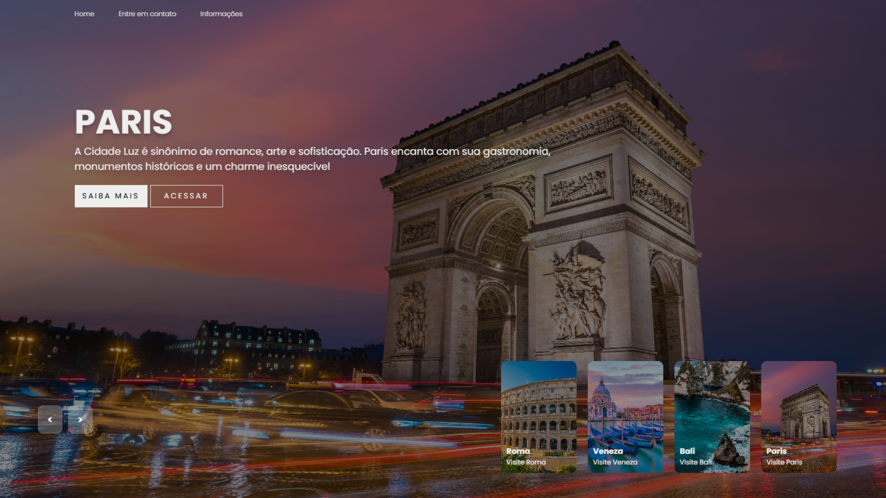

<h1 align="center"> Carrossel Interativo - Projeto Front-End </h1>

 Projeto de Carrossel Interativo desenvolvido com HTML e CSS e JavaScript básico, baseado em um vídeo do canal DevClub no Youtube. 

    

## ✨ Funcionalidades
- Página de login estilizada com CSS
- Thumb Interativa com JavaScript
- Plano de fundo interativo
- Estilização com efeitos suaves com o hover

## 🚀 Tecnologias
Esse projeto foi desenvolvido com as seguintes tecnologias:

- HTML
- CSS
- JavaScript

## 🧠 Aprendizados
Este projeto foi construido acompanhando uma videoaula do DevClub, e me ajudou a reforçar:
- Estruturação de uma página HTML do zero
- Posicionamento e alinhamentos com Flexbox
- Criação de um carrossel interativo utilizando JavaScript
- Aplicação e transições CSS para dar fluidez às trocas de slides
- Boas práticas de organização de arquivos 

## 💻 Projeto
- [Acesse o projeto finalizado](https://carrossel-project-1.netlify.app/)

---

Feito por Fernanda Bortoletto

